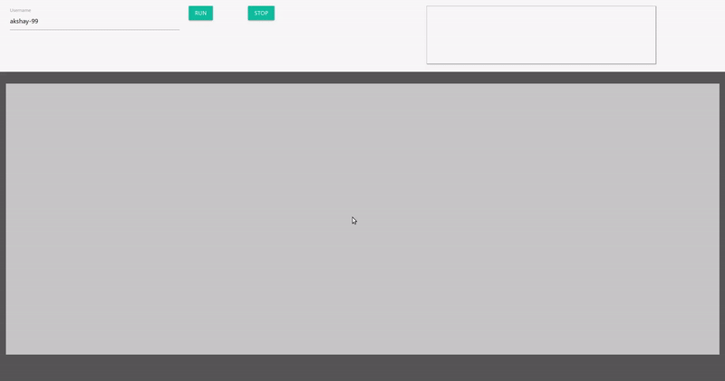

 

------------------------------------------
> Six Degrees of Separation is the idea that you could reach any person in the world with fewer than six intermediate connections. 

> If person A knows a few people and each of them know few more non-overlapping set of people and so on and we keep a track of all these connections, by the time we reach six degrees, we would have looked at billions of people

> This is a simple in-browser simulation of the concept using the connections on Github.
> This projects builds a visualization of all the connections of a user and the connections of these connections and so on and traces a route from an n-th degree node back to the origin.

> It can serve the purpose of explaining graph algorithms in an intuitive way and visual way ( other than the purpose of helping me kill my boredom on a lazy Sunday )  

> To try out go to: <a href="https://sixdegreeofsep.surge.sh" target="_blank">Six Degrees of Seperation</a>

##### Demo 

  

------------------------------------------

### Future Goals
- [ ] Improve CSS
- [ ] Improve mobile support
- [ ] Adding Stats and stuff

------------------------------------------
### Contributing
 This repo is open to `enhancements` & `bug-fixes` :smile: 

### Note

 This project was done in my free time under `5 hours with no pre-preparation`

------------------------------------------
### Contributors

- [@akshay-99](https://github.com/akshay-99)

------------------------------------------

Made with &hearts; by <a href="https://github.com/akshay-99" target="_blank">akshay-99</a>

